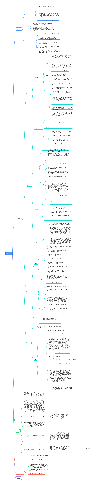

# RETE-Python
用 Python 实现的一个简易的 RETE 。

参考文献：[Production Matching for Large Learning Systems](http://citeseerx.ist.psu.edu/viewdoc/download;jsessionid=27AD61CD1B6A00CCA3DD5B6F9BBD383E?doi=10.1.1.83.4551&rep=rep1&type=pdf)

文献阅读笔记及复现代码的结构整理：[RETE笔记](https://note.youdao.com/s/1YP1z3Eq)

预览图如下（脑图导出为图片后，效果不是太好，直接通过上述链接查阅）：

